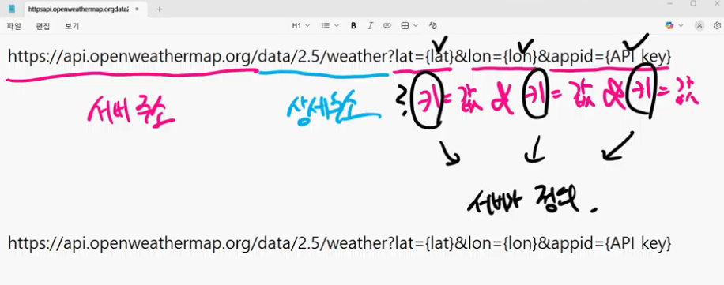

## API란 무엇인가

> 날씨 정보를 가져오고 싶은 상황이지만,
>
> 직접 데이터를 모으기란 너무 어렵다...
> 
> 그렇다면?
> 
> 인터넷에 있는 데이터를 가져오면 된다! 

### 서버와 클라이언트

- 서버 : 부탁을 받은 뒤 처리 or 원하는 값을 반환
- 클라이언트 : 부탁

#### 클라이언트 -> 서버 요청 방법

1. 웹 브라우저(크롬)을 켜서 주소창에 주소를 입력

2. 서버에 정보를 요청하는 파이썬 코드를 작성

### pip 와 패키지

- pip : 라이브러리, 패키지 들을 관리하는 관리도구 

- 라이브러리 : pip install~ 등올 통해 설치 

### venv 가상환경 사용 시

- 1,000여개가 넘는 파일들이 생성됨
- gitignore가 필수
- `freeze > requiremnets`로 필수적인 패키지 설치를 안내 

### request 응답 규칙 (웹)
- 200 : 정상
- 404 : 못 찾겠다
- 401 : 권한 X

#### pprint : 데이터 구조를 파악하기 용이한 pretty print

### 서버는 어떻게 요청을 해석할까? 

- 클라이언트를 통해 요청을 보내는 법은 알겠는데,

- 서버는 어떻게 요청을 수신해서 응답을 줄 수 있을까? 

## API

: 클라이언트가 원하는 기능을 수행하기 위해 서버 측에 만들어놓은 프로그램 

- 서버 측에 특정 주소로 요청이 오면 정해진 기능을 수행하는 API를 미리 만들어 둡니다. 
  - 클라이언트는 서버가 미리 만들어 놓은 주소로 요청을 보냅니다. 

따라서, 정보를 가져오고자 할 때 

필요한 것은 서버 + API 

- API KEY

: 사용자 구분을 위해 서버에서 발급해주는 KEY로, 클라이언트가 정보를 요청할 때마다 함께 API KEY를 제공해야 함

### JSON 

: 자바 스크립트 객체 표기법으로, 경량의 텍스트 기반 데이터 형식 

- 데이터 표현 방식 중 하나

- 특징 (dict와 유사)
  - 키 = str(유일한 차이점) / 값 = 다양한 데이터 유형
  

  ### JSON - 

  - 파싱 : 데이터를 의미있는 구조로 분석하고 해석하는 과정 
- json.loads() : JSON 형식의 문자열을 파싱하여 python dict로 변환 

### 실습 - Current Weather API 

- 공식 문서를 반드시 확인

