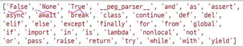

## 1-1. Python_Basic_Syntax_01


프로그램이란? 

문제를 해결하기 위한 명령어들의 집합 

- 핵심 : 새 연산을 정의 및 조합, 유용한 작업을 수행

&nbsp; 

우리가 배우는 Python 

- 세계적으로 가장 많이 활용 및 수요가 있음
- 인공지능, ML 분야에서 강력한 라이브러리 환경을 구축

&nbsp;

tip! 코드는 반드시 한땀 한땀 입력하자. 

---

### 표현식 

: 하나의 '값'으로 평가될 수 있는 모든 코드

```
#1.     3 + 5
#2.     x > 10
#3.     5 * 4
```

### 값 

: 표현식이 평가된 결과

- 더 이상 계산되거나 평가될 수 없는, 프로그램의 가장 기본적인 데이터 조각 

- 평가 : 표현식을 계산하여 값을 만들어내는 과정 

  - 표현식 -> 값

---

### 변수 

: 값을 재사용하기 위해 그 값에 붙여주는 고유한 이름 

1. 변수 할당(Variable Assignment)

    : 표현식이 만들어낸 값에 대해 이름을 붙이는 과정(연결)


1-1. 할당문 예시

```
degrees = 36.5

# degrees : 변수 이름
# = : 할당 연산자
    #  오른쪽 값을, 왼쪽에 할당한다.

# 36.5 : 표현식 (or 값)
```

&nbsp;

3. 변수명 규칙(파이썬 공식문서)

```
ssafy_student = 1
```

- 변수명으로 사용할 수 없는 것들




- 변수는 각자 고유한 메모리 주소를 가지고 있음

    - 우리는 메모리 주소를 정확히 기억하고 있지 않지만, 인덱스를 보고 그 값을 찾을 수 있음

&nbsp;

1. 재할당 (Reassingment)

해당 변수가 가리키는 대상을 새로운 값으로 변경하는 행위

```python

number = 10
double = 2 * number
print(double)

number = 5
print(double) # 답은 20.
              # number 변수는 새로운 5 값을 참조함
```

**프로그래밍 코드는 이어지는 것이 아닌, 별개의 문장으로 이해하는 것이 효율적!**


